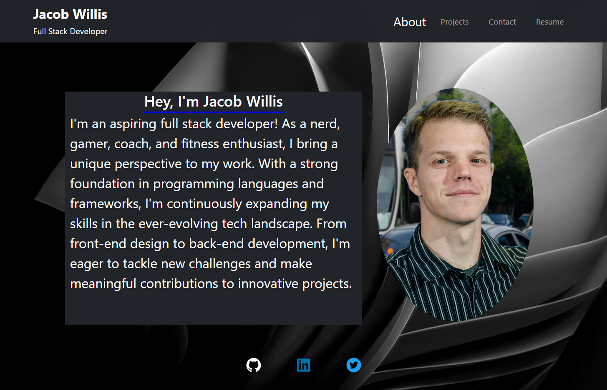

# School_Portfolio

## Description

The purpose of this assignment was to demonstrate React skill by buildilng a fully functional portfolio application. React makes coding a lot more enjoyable and using Bootstrap along side React makes it much easier. I enjoyed making my first React App and I am only expecting to improve from here. If it were not for a deadline I would have gladly spent more time into this to style it some more.

## Table of Contents

- [Installation](#installation)
- [Usage](#usage)
- [License](#license)
- [Contributing](#contributing)
- [Tests](#tests)
- [Questions](#questions)

## Installation

npm i

## Usage

Website Screenshot  

Deployed Website  

## Credits

NPM: https://www.npmjs.com/  
BootStrap: https://getbootstrap.com/  
React: https://legacy.reactjs.org/docs/getting-started.html  

## License

This project is licensed under the MIT license. Click [here](https://opensource.org/licenses/MIT) for more information.

MIT License

    Permission is hereby granted, free of charge, to any person obtaining a copy of this software and associated documentation files (the "Software"), to deal in the Software without restriction, including without limitation the rights to use, copy, modify, merge, publish, distribute, sublicense, and/or sell copies of the Software...

## Tests

N/A

## Questions

If you have any questions about the repo, open an issue or contact me directly at something@example.com. You can find more of my work at [JacobRyanWillis](https://github.com/JacobRyanWillis/).
